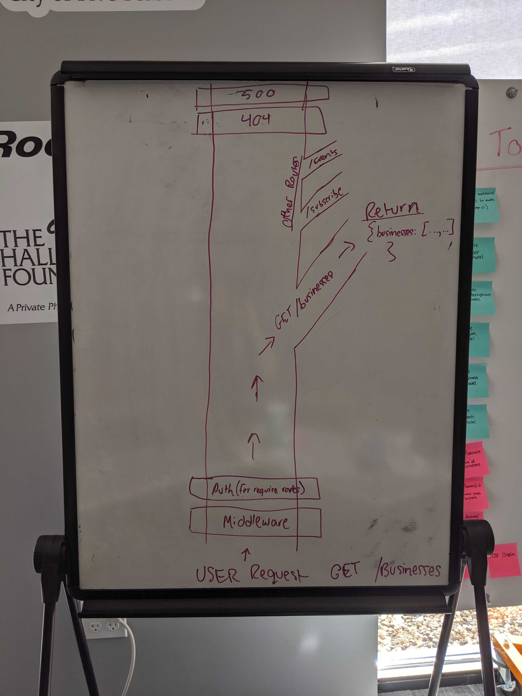

### Vision 

#### What is the vision of this product? 
To support local businesses by providing them with an application to be able connect with current and potential customers.

#### What pain point does this project solve? 
Keeps customers from having to download individual apps for each business while helping local businesses from having to invest into their own app development.

#### Why should we care about your product? 
We bring local businesses and consumers together by sharing updates of new and/or ongoing deals within a certain radius. This in turn will strengthen the business within the community and spur local economic growth during slow periouds of consumption. We also send out SMS/email (working on push) notifications so customers can be notified immediately if a business they're following is having a sale or specific specials. Business owners can make spur of the moment special and sale decisions and get the word out to people interested at a moments notice to increase store traffic.

### Scope 

#### IN 
* Businesses can request to be approved to manage a business page, where they can post information about their business, as well as sales/events they have going on.
* Customers are able to signup/signin/signout as a User within the application
* Users can view local businesses and events, can search by name and filter by business categories
* Users can subscribe to individual businesses or categories of businesses to be notified of their events.
* Owners/managers can post events for their businesses. Anyone subscribed to the business or category will be notified of new events.

##### OUT
* NOT GROUPON!!
* NO upfront cost to businesses for any services provided.
* Refrain from spamming customers.

#### MVP 
* Customers are able to signup/signin and subscribe to local businesses/categories.
* Businesses are able to signup/request approval.
* Approved businesses can manage the info on their page, and submit events/sales to which users can subscribe.
* Subscribed customers will receive notifications(email) when a business posts new events

#### Stretch
* Expiring coupones (one-time use or time expiration)
* SMS notifications,
* Oauth (google, microsoft?, not Amazon)

### Functional Requirements

1. A user can subscribe/unsubscribe to/from businesses/categories.
2. Approved business owners can update information about their businesses and post new events.
3. Admins can approve businesses for posting information/events.
4. All subscribed users will receive a notification for new events.
5. Users can search for businesses or events by name/category

### Non-Functional requirements
1. Security
    * Hashed passes (use bcrypt) 
    * Basic and Bearer auth (OAuth stretch)
    * ENV (Secrets, port, connection URI)
2. Documentation
    * Swagger Documentation for each route
    * JSDoc for each function/module
    * Well-formated and updated README
3. Testability
    * All Pull requests must be passing Travis tests before merging
    * Tests for each module (yes, even the web-related ones)
    * TDD - implement tests as you are working on modules
4. Presentation
    * A good, well-spoken presentation that covers all the major functionality. Not 75% joke slides.
    * Practice presentation in full at least twice the day before actual presentation.

#### Data Flow

